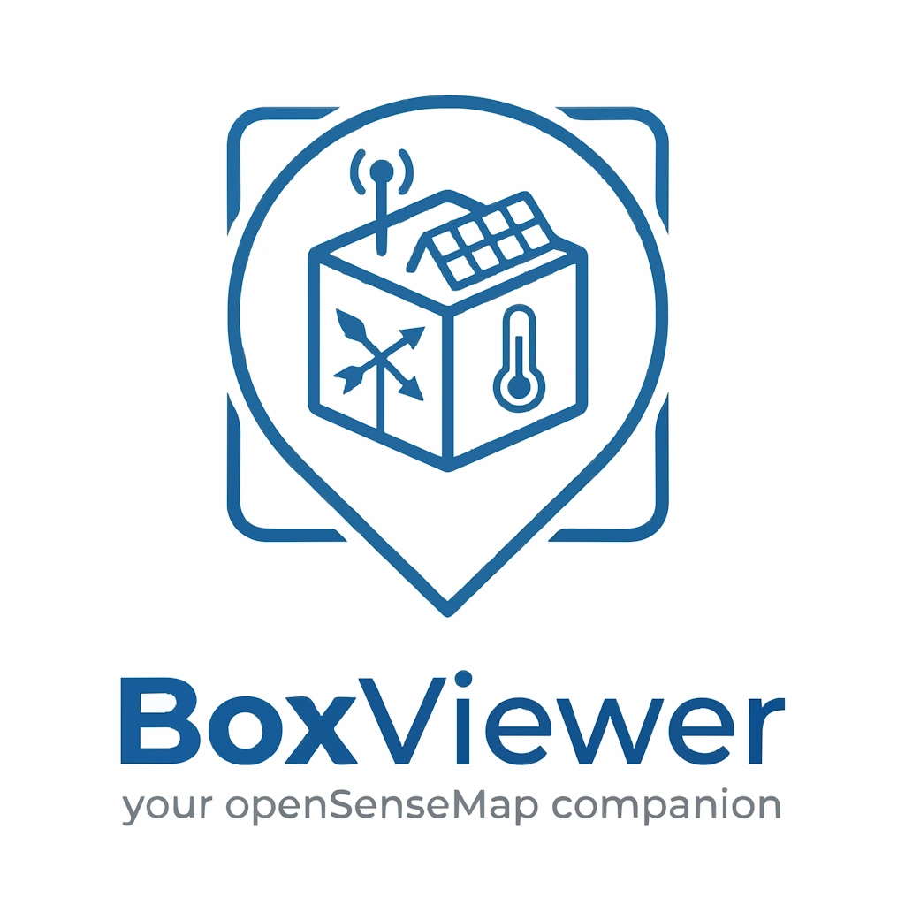

# BoxViewer

  

  <b>A beautiful, modern, privacy-first openSenseMap Android client.</b>

  
  

  
  
  

---

**BoxViewer** is a modern, fully-featured, open-source Android app for [openSenseMap](https://opensensemap.org) — a global open-data platform for environmental sensor networks and DIY weather stations (senseBoxes).

Crafted with **Kotlin** and **Jetpack Compose** following Material Design 3 guidelines, BoxViewer enables environmentalists, hobbyists, and researchers to locate nearby sensor stations, monitor micro-climate telemetry streams in real time, and configure home-screen widgets for instant, glanceable observation.

## ✨ Key Features

*   **🔒 Privacy-First & De-Googled Friendly**: 100% free of Google Play Services (GMS) dependencies in the app code. Core functionality relies on the native Android `LocationManager` and direct openSenseMap APIs. Address search and location labels may use the device’s native geocoder (ROM-dependent backend) or an OpenStreetMap-based fallback; see the Privacy Policy for details. Zero telemetry, analytics, or third-party trackers.
*   **📊 Live Interactive Dashboard**: Favorite and save specific environmental stations. Customize exactly which sensor metrics (Temperature, Humidity, UV, PM2.5, Barometric Pressure, etc.) you want to track at a glance.
*   **🔍 Smart Discovery Engine**: Locate public senseBoxes from the openSenseMap community using direct search by name/ID, location address auto-complete, or on-demand GPS discovery.
*   **📈 Rich Telemetry Analysis**: Deep telemetry streams visualization including units, last updated timestamps, coordinates, station type, and exposure type (indoor vs. outdoor).
*   **🔋 Battery & API-Friendly**: Seamless local SQLite caching (`SensorCacheEntity`) and awake-on-unlock widget refresh logic ensure you get fresh data without draining your battery or hammering openSenseMap servers.
*   **🌬️ Air Quality Index Engine**: Six international AQI standards (US EPA, UK DAQI, EU EAQI, Canada AQHI, India, China) with a virtual synthesized sensor and 12-hour NowCast averaging computed locally from cached openSenseMap data.
*   **🌡️ Local Unit Conversion**: Per-sensor unit switching for temperature (°C/°F/K), pressure (hPa/mbar/Pa/inHg/mmHg), and wind (m/s/km/h/mph/kn) performed entirely on-device.
*   **📱 Glanceable Home Widgets**: Customize home screen widgets featuring Material Design 3 theme colors to monitor your favorite senseBox metrics. Supports text & icon scaling up to 200%, toggling detail styles (Full Details, Value & Unit, Value Only), conditional formatting, AQI display modes, and direct home-screen reconfiguration on Android 12+. 
*   **🔗 Quick Sharing & Deep Linking**: Generate local QR codes to share senseBox stations. Recipients scan the code or open a sharing web link to view the station directly inside the BoxViewer app.
*   **🛠️ Local API Debug Logging**: Opt-in to capture raw API requests, responses, and Moshi parsing results in a JSON Lines (`.jsonl`) file stored locally. Copy or share logs via native sheets to diagnose errors easily.

---

## ⬇️ Download & Install

BoxViewer is distributed as an independent APK package and is compatible with Android 7.0 (API 24) and above.

### 🚀 Direct Download
You can download stable APKs directly from Codeberg — no account required:

*   **[Download Stable APKs](https://codeberg.org/nichu42/BoxViewer/releases)**: Recommended for most users. Contains vetted, officially tagged stable releases.

### 🔄 Automatic Updates with Obtainium
To receive automatic updates on de-googled systems, we recommend using **[Obtainium](https://github.com/ImranR17/Obtainium)**:
1. Copy the Codeberg repository link: `https://codeberg.org/nichu42/BoxViewer`
2. Open Obtainium and select **Add App**.
3. Paste the URL and click **Add** to start tracking releases.

---

## ☕ Support the Developer

BoxViewer is developed with love as an open-source project. If you are happy with the app and would like to support its ongoing development, please consider donating:

  
  

---

🛠️ <b>Technical Architecture & Tech Stack (For Developers)</b>

 

BoxViewer adheres to the strict guidelines of modern Android architecture (MVVM / Clean Architecture style) enabling clean decoupling between database layers, networking models, and the UI.

*   **UI Framework**: [Jetpack Compose](https://developer.android.com/jetcompose) (declarative UI with type-safe compose navigation).
*   **Architecture**: `ViewModel` + `StateFlow` + structured asynchronous coroutine builders (`lifecycleScope`, `collectAsStateWithLifecycle`).
*   **Local Persistence Layer**: [Room Database](https://developer.android.com/training/data-storage/room) using Kotlin Symbol Processing (KSP) compilation to persist configurations, widgets, and offline caches.
*   **Networking Server-Client**: [Retrofit 3](https://square.github.io/retrofit/) coupled with [OkHttp 5](https://square.github.io/okhttp/) and [Moshi](https://github.com/square/moshi) to carry out efficient JSON processing of the openSenseMap API.
*   **Asynchrony Core**: Kotlin [Coroutines](https://kotlinlang.org/docs/coroutines-overview.html) & [Flow](https://kotlinlang.org/docs/flow.html).
*   **QR Code Utilities**: [ZXing Core](https://github.com/zxing/zxing) barcode image processing library for local generation of station QR sharing codes.
*   **Core Security Integration**: Secrets Gradle Plugin configured with safe `.env` runtime configurations to decouple keys and configurations from version-control processes.
*   **Local Testing Ecosystem**: Fully integrated [Robolectric](https://robolectric.org/) testing suites running on high-speed headless JVM surfaces combined with [Roborazzi](https://github.com/takahirom/roborazzi) for visual screenshot regression testing.

---

## 🌍 Data & Attribution (openSenseMap)

This app utilizes the open API provided by **openSenseMap**, an open-source platform dedicated to collecting and exploring environmental sensor data from around the globe.

### What is openSenseMap?
Originally emerged from a research project at the University of Münster (Germany), openSenseMap has grown into one of the largest citizen-operated sensor networks in the world. It provides a free platform for schools, universities, scientists, and citizen enthusiasts to publish real-time environmental measurements—such as air quality, temperature, and humidity—and share them as Open Data.

### Who operates it?
The platform is operated and maintained by **openSenseLab gGmbH**, a non-profit organization based in Münster, Germany, dedicated to promoting digital sovereignty, education, and public participation in scientific environmental monitoring.

### Support Open Data!
openSenseMap is completely free to use and relies heavily on community contributions and donations to keep its servers running and its data accessible to all. If you love the environmental insights provided in this app, please consider supporting their project:
*   **Explore**: [opensensemap.org](https://opensensemap.org)
*   **Build**: [sensebox.de](https://sensebox.de)
*   **Donate**: [Donate via Betterplace](https://www.betterplace.org/en/projects/89947-opensensemap-org-the-free-map-for-environmental-data)

---

## 🍃 Air Quality Index (AQI) Integration

BoxViewer features a built-in Air Quality Index engine that supports six major international standards:
1. **US EPA AQI**: 0–500 numerical scale (United States standard)
2. **UK DAQI (DEFRA)**: 1–10 numerical scale (United Kingdom standard)
3. **European EAQI**: Qualitative severity bands (European Union standard)
4. **Canada AQHI**: 1–10+ numerical scale (Canadian PM2.5-only risk indicator)
5. **India AQI**: 0–500 numerical scale (Indian standard)
6. **China AQI**: 0–500 numerical scale (Chinese HJ 633-2012 standard)

### ⚙️ How it Works

*   **Consolidated Virtual Sensor**: If a senseBox measures particulate matter (PM2.5 and/or PM10), BoxViewer generates a local virtual sensor titled **"Air Quality Index (Instant)"**. If both PM2.5 and PM10 are present, the index automatically reports the worst-case (maximum) score of the two sub-indices.
*   **InstantCast**: The live virtual sensor value displayed on the dashboard cards and home screen widgets represents the **InstantCast** (instantaneous concentration converted directly to the selected AQI standard).
*   **NowCast**: When expanding a detailed sensor card, BoxViewer pulls up to 12 hours of historical readings and applies the official **NowCast** algorithm (a weighted rolling average designed by the EPA to smooth out short-term noise and spikes) to display a true 12-hour AQI NowCast banner.
*   **Customization**: You can switch between the six AQI standards under the **AQI Standard** setting.

---

## 📜 Copyright & License Info

**Copyright (C) 2026 nichu42 and contributors**

This program is free software: you can redistribute it and/or modify it under the terms of the **GNU General Public License v3.0** as published by the Free Software Foundation, either version 3 of the License, or (at your option) any later version.

This program is distributed in the hope that it will be useful, but WITHOUT ANY WARRANTY; without even the implied warranty of MERCHANTABILITY or FITNESS FOR A PARTICULAR PURPOSE. See the GNU General Public License for more details.

For details on how user location privacy and on-device telemetry logs are strictly handled, please read the [Privacy Policy](PRIVACY.md).

---

## ⚠️ Affiliation Disclaimer

*The BoxViewer app is an independent project and is not affiliated with, endorsed by, or connected to openSenseMap (openSenseLab gGmbH) or senseBox (Reedu GmbH & Co. KG) in any way.*
